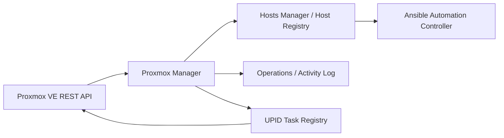

# Proxmox Manager

Proxmox Manager integrates Proxmox VE with the existing WebNAS/Algen host-management architecture without creating a second VM/LXC inventory database.

## Architecture and ownership



Host Registry is the canonical inventory. Proxmox Manager stores connection configuration, synchronization runtime state and non-secret UPID task metadata only.

A Proxmox resource is identified by:

- `algen_provider = proxmox`
- `algen_provider_instance_id = <Proxmox connection ID>`
- `algen_provider_resource_id = <VMID>`
- VMID

`<connection ID, VMID>` remains stable when a VM migrates between nodes. A migration updates `proxmox_node` on the existing Host Registry record; it does not create a new `host_id`.

User-owned Host Registry data is preserved during synchronization, including credentials, groups, approval, user tags, SSH configuration, environment and location.

## Credentials and TLS

Proxmox Manager never stores a Proxmox token or password in its SQLite database. Connections contain only `credential_id`, pointing to the central Hosts Manager credential/secrets system.

Supported authentication:

- `proxmox_api`: username `user@realm!tokenid` plus API token secret.
- `username_password`: server-side Proxmox ticket authentication plus CSRF token.

The connection dialog can select an existing shared credential or create a central `username_password` credential. The password is sent to the credential store and is not copied into Proxmox Manager.

TLS verification is enabled by default. A private CA can be supplied as PEM. Disabling TLS verification is supported per connection for controlled lab use. Error messages are sanitized and do not include credential secrets.

All Proxmox operations use the REST API. The module does not use SSH, `pvesh`, user-built shell commands or arbitrary user-supplied API paths.

## Dashboard

The Overview page aggregates live and runtime information:

- configured and active connections
- nodes and online nodes
- QEMU VM and LXC counts
- running/stopped counts
- templates
- CPU, RAM and storage utilization
- cluster quorum and HA resource count
- Proxmox API errors
- last and next automatic synchronization
- active and failed UPID tasks
- number of VMs linked to Host Registry

## Nodes

`GET /api/modules/proxmox-manager/nodes`

The node list shows status, uptime, CPU utilization, RAM, root storage, kernel, Proxmox version, load average and VM/LXC counts.

Node details use safe fixed REST paths for:

- status
- network interfaces
- DNS
- subscription
- APT repositories
- services

Some sections depend on the Proxmox version and token permissions. A failure of an optional section is returned as a section-specific error instead of making the entire node view fail.

## VM / LXC inventory and details

`GET /api/modules/proxmox-manager/vms` remains a live Proxmox view joined to Host Registry by stable provider identity. It is not persisted as a second inventory.

The frontend supports search, sorting and filters by node, VM/LXC type, status and tag. It displays connection, VMID, node, IP/Host Registry address, uptime, CPU, RAM, disk, tags and Host Registry state.

`GET /api/modules/proxmox-manager/connections/{connection_id}/vms/{vmid}` returns a detailed view containing:

- current runtime status
- OS/guest information when available
- QEMU Guest Agent availability
- configured CPU, sockets, RAM, balloon, machine and BIOS
- disks, storage, size, cache, discard and IO thread flags
- network adapters, MAC, bridge, VLAN and model
- Host Registry `host_id`, address, approval and user tags

## Snapshots

Supported operations:

- list snapshots
- create snapshot with optional description
- include QEMU VM state/RAM when requested
- delete snapshot
- rollback snapshot

Delete and rollback require the exact VM name as confirmation. Every write returns or registers a Proxmox UPID when the API operation is asynchronous.

## Clone

VM/LXC cloning uses the Proxmox REST API and supports:

- source VM/template
- full or linked clone when accepted by Proxmox for the source/storage combination
- new VMID and name
- target node
- target storage
- pool
- optional Host Registry synchronization after the UPID completes successfully

Templates are discovered live through the Proxmox API and are not duplicated in local storage.

## Migration

Migration is a two-stage operation:

1. Validate destination node/storage and basic compatibility.
2. Execute only after exact VM-name confirmation.

QEMU migration supports online/offline mode, local disks, target storage and `migration_network` where supported by the Proxmox API. LXC online migration is intentionally rejected by this implementation; use offline migration.

Host identity remains `<connection ID, VMID>`, so a successful migration followed by synchronization updates the existing Host Registry host rather than creating a duplicate.

## Hardware changes

The hardware editor exposes a plan before applying changes:

```text
Current value -> New value
```

Supported writes:

- cores
- sockets
- RAM
- balloon
- QEMU disk growth

Disk resize only permits growth. Shrink or equal-size requests are rejected before calling Proxmox. Hardware apply and disk growth require exact VM-name confirmation.

## Storage, cluster and backups

Storage view is read-only except when a selected storage is passed to clone/migration/create operations. It shows node, storage type, state, total/used/free space, utilization, shared/local scope and content types.

Cluster view is monitoring-only. It shows cluster name, quorum, node availability, votes, HA resources and HA groups. Cluster creation/removal is deliberately not exposed.

Backup visibility is read-only. The module enumerates backup-capable storage through the REST API and shows backup volume, VMID, timestamp, size, storage and node when a backup can be unambiguously matched to the VM.

## UPID Task Manager

Proxmox returning a UPID is treated as the start of an asynchronous operation, not as completion.

The local task registry stores only operational metadata:

- connection ID
- UPID
- action
- VMID
- node owning the UPID
- resource type
- actor
- Host Registry host ID
- Operations record ID
- status and exit status
- progress
- start/end/update timestamps
- sanitized error
- post-task Host Registry sync flags

Statuses are `Queued`, `Running`, `Completed` and `Failed`.

The frontend polls active tasks without reloading the whole page. The node embedded in the UPID is authoritative for task polling, which is important for clone/migration jobs where the destination node can differ from the task-owning source node.

Task APIs:

- `GET /api/modules/proxmox-manager/tasks`
- `GET /api/modules/proxmox-manager/tasks/{upid}`
- `GET /api/modules/proxmox-manager/tasks/{upid}/log`

Clone, create and migration can request a Host Registry refresh after successful task completion. Migration therefore preserves the same `host_id` while updating the node metadata.

## Automatic synchronization

Each connection supports:

- `auto_sync`
- `sync_interval_seconds` from 60 to 86400
- last sync timestamp
- last sync start
- next sync timestamp
- last duration
- last result
- last error
- consecutive failure count
- backoff deadline

The scheduler performs full Host Registry inventory synchronization when a connection is due. A per-connection lock prevents two synchronizations of the same connection from running concurrently. A failure in one cluster is isolated and does not stop other connections. Consecutive failures use capped exponential backoff.

The existing Proxmox metadata tag synchronization remains enabled independently and can run even when full automatic inventory synchronization is disabled.

## Create VM

The Create VM wizard creates a QEMU VM through the REST API with:

- VMID and name
- node
- CPU cores and sockets
- RAM
- storage and disk size
- bridge and optional VLAN
- DHCP or static IPv4
- gateway and DNS
- cloud-init user
- SSH public key

There is no cloud-init plaintext password field. Use an SSH public key and/or the central credential/secrets workflow after Host Registry enrollment.

The direct create flow creates a cloud-init-capable QEMU VM and tracks its UPID. Existing templates use the Clone action, because clone is asynchronous and subsequent configuration must not be applied before the clone task completes. `start_after_create` is currently rejected rather than pretending the VM has started before the asynchronous create UPID completes; start the VM after the task reaches `Completed`.

## RBAC and destructive operations

The module reuses existing Hosts Manager permissions instead of creating a competing authorization model:

- read inventory/health: `hosts-manager.hosts.view` / `hosts-manager.view`
- connection configuration: `hosts-manager.configure`
- create/clone/migrate/snapshot/hardware/sync: `hosts-manager.hosts.manage`
- power: existing `hosts-manager.power.*` permissions
- central credential creation: `hosts-manager.credentials.manage`

Destructive operations require additional exact-name confirmation. Host Registry approval remains authoritative for shared host capabilities and downstream Ansible execution.

## Activity and Operations integration

Activity Log records connection changes, sync, create VM, clone, migrate, snapshot create/delete/rollback, hardware update, disk resize and power operations. Details contain resource identifiers and UPID state, never secrets.

Asynchronous operations are also registered in the existing Operations system and linked to the local UPID task record by `operation_id`.

## API reference

| Method | Endpoint | Purpose |
| --- | --- | --- |
| GET | `/api/modules/proxmox-manager/dashboard` | Aggregate health/dashboard |
| GET/POST | `/api/modules/proxmox-manager/connections` | List/create connections |
| PUT/DELETE | `/api/modules/proxmox-manager/connections/{id}` | Update/disable connection |
| POST | `/api/modules/proxmox-manager/connections/{id}/test` | Test connection |
| POST | `/api/modules/proxmox-manager/connections/{id}/sync` | Full Host Registry sync |
| GET | `/api/modules/proxmox-manager/vms` | Live VM/LXC list |
| GET | `/api/modules/proxmox-manager/connections/{id}/vms/{vmid}` | VM/LXC detail |
| POST | `/api/modules/proxmox-manager/connections/{id}/vms/{vmid}/power` | Power operation |
| GET | `/api/modules/proxmox-manager/nodes` | Nodes |
| GET | `/api/modules/proxmox-manager/nodes/{node}` | Node details |
| GET | `/api/modules/proxmox-manager/nodes/{node}/status` | Node status |
| GET | `/api/modules/proxmox-manager/storage` | Storage visibility |
| GET | `/api/modules/proxmox-manager/cluster` | Cluster/HA health |
| GET | `/api/modules/proxmox-manager/templates` | Live templates |
| GET | `/api/modules/proxmox-manager/connections/{id}/vms/{vmid}/backups` | Backup visibility |
| GET/POST | `/api/modules/proxmox-manager/connections/{id}/vms/{vmid}/snapshots` | List/create snapshots |
| DELETE | `/api/modules/proxmox-manager/connections/{id}/vms/{vmid}/snapshots/{snapshot}` | Delete snapshot |
| POST | `/api/modules/proxmox-manager/connections/{id}/vms/{vmid}/snapshots/{snapshot}/rollback` | Roll back snapshot |
| POST | `/api/modules/proxmox-manager/connections/{id}/vms/{vmid}/clone` | Clone VM/LXC |
| POST | `/api/modules/proxmox-manager/connections/{id}/vms/{vmid}/migration/validate` | Validate migration |
| POST | `/api/modules/proxmox-manager/connections/{id}/vms/{vmid}/migration` | Execute migration |
| POST | `/api/modules/proxmox-manager/connections/{id}/vms/{vmid}/hardware/plan` | Preview hardware delta |
| PUT | `/api/modules/proxmox-manager/connections/{id}/vms/{vmid}/hardware` | Apply hardware delta |
| PUT | `/api/modules/proxmox-manager/connections/{id}/vms/{vmid}/disks/resize` | Grow QEMU disk |
| POST | `/api/modules/proxmox-manager/connections/{id}/vms` | Create QEMU VM |
| GET | `/api/modules/proxmox-manager/tasks` | Task list |
| GET | `/api/modules/proxmox-manager/tasks/{upid}` | Task status |
| GET | `/api/modules/proxmox-manager/tasks/{upid}/log` | Task log |

## Proxmox permissions

Exact privileges depend on which functions are enabled. A read-only monitoring token needs permission to read cluster/node/VM/storage/config/task state. Write features additionally need the corresponding Proxmox VM privileges for power, configuration, snapshots, clone, migration and allocation/storage operations. Tag synchronization normally requires `VM.Config.Options`. Use the narrowest Proxmox role that covers the selected features and scope it to the required cluster paths/resources.

## Local database migration

The migration is additive and backward compatible. Existing `connections` rows remain valid. New runtime columns receive defaults, and a new `proxmox_tasks` table stores UPID metadata. No VM/LXC inventory table and no secret-bearing columns are introduced.
