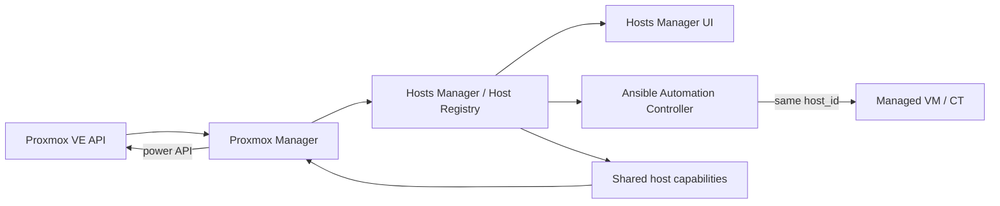

# Proxmox Manager

Proxmox Manager integrates Proxmox VE with the existing WebNAS/Algen host-management architecture without creating a second inventory database.

## Architecture



The canonical machine object is always a Hosts Manager host.

Proxmox Manager stores only Proxmox connection configuration in `/var/lib/webnas/proxmox-manager/proxmox.sqlite3`. It does not store a separate persistent VM inventory. Every synchronized Proxmox VM or LXC container is created or updated through the public `HostRegistryService` contract.

## Shared identity

A Proxmox resource is identified by:

- `algen_provider = proxmox`
- `algen_provider_instance_id = <Proxmox connection ID>`
- `algen_provider_resource_id = <VMID>`

The pair `<connection ID, VMID>` is stable even when a VM is migrated to another Proxmox node. Synchronization therefore updates the existing `host_id` instead of creating a duplicate host.

Provider metadata is stored in the host `variables` field:

- `proxmox_vmid`
- `proxmox_node`
- `proxmox_resource_type` (`qemu` or `lxc`)
- `proxmox_name`
- `proxmox_status`
- `proxmox_present`

User-owned host fields such as SSH credential, groups, approval status and manually adjusted host name remain attached to the same central host record.

## Credentials

Proxmox API secrets are stored only in Hosts Manager → Credentials.

Create a credential with:

- type: `proxmox_api`
- username: `user@realm!tokenid`, for example `automation@pve!algen`
- secret: Proxmox API token secret

Proxmox Manager stores only the resulting `credential_id`. The token secret is decrypted by the controlled Hosts Manager credential API only when a Proxmox request is made.

TLS verification is enabled by default. A custom CA certificate can be configured for a private Proxmox CA. Disabling TLS verification is available per connection but should be limited to isolated lab environments.

## Synchronization

`POST /api/modules/proxmox-manager/connections/{connection_id}/sync`

Synchronization performs the following steps:

1. Reads current VM/CT resources from the Proxmox cluster API.
2. Resolves a guest address using QEMU Guest Agent or LXC interface data when possible.
3. Matches an existing host by `<connection ID, VMID>`.
4. Creates or updates the canonical Hosts Manager record.
5. Preserves the same `host_id` used by Hosts Manager and Ansible Automation Controller.
6. Marks resources missing from Proxmox as inactive and sets `proxmox_present=false` instead of deleting their history.

A newly discovered host is not automatically approved. This keeps Ansible remote execution behind the existing Hosts Manager approval boundary.

If a guest does not expose a usable IP address, synchronization falls back to a valid DNS-style VM name. If neither an address nor a usable name is available, the VM is reported as skipped rather than creating an invalid central host.

## Ansible integration

Ansible Automation Controller already consumes Hosts Manager host records and keeps their central IDs. No Proxmox-specific Ansible inventory table is required.

After synchronization:

```text
Proxmox VMID 101
        │
        ▼
Hosts Manager host_id = 4f...
        │
        ├── Hosts Manager actions
        ├── Ansible inventory / playbooks
        └── Proxmox power capabilities
```

Ansible capabilities remain subject to the existing host `active` and `approved` checks and SSH trust/credential requirements.

## Power operations

Proxmox Manager supports:

- start
- graceful shutdown
- reboot
- immediate stop

The same operations are also registered as Hosts Manager `HostCapabilityProvider` actions for Proxmox-backed hosts. This means the action can be launched from either Proxmox Manager or the shared Hosts Manager host context and still targets the same canonical host.

Shutdown, reboot and immediate stop require explicit confirmation using the exact VM/host name.

## API

| Method | Endpoint | Purpose |
| --- | --- | --- |
| GET | `/api/modules/proxmox-manager/dashboard` | Summary |
| GET | `/api/modules/proxmox-manager/connections` | List Proxmox connections |
| POST | `/api/modules/proxmox-manager/connections` | Add connection |
| PUT | `/api/modules/proxmox-manager/connections/{id}` | Update connection |
| DELETE | `/api/modules/proxmox-manager/connections/{id}` | Disable connection |
| POST | `/api/modules/proxmox-manager/connections/{id}/test` | Test API connection |
| POST | `/api/modules/proxmox-manager/connections/{id}/sync` | Synchronize VM/CT resources to Host Registry |
| GET | `/api/modules/proxmox-manager/vms` | Live VM/CT list joined with shared `host_id` |
| POST | `/api/modules/proxmox-manager/connections/{id}/vms/{vmid}/power` | Power action |

## Data ownership

| Data | Owner |
| --- | --- |
| Proxmox endpoint/TLS settings | Proxmox Manager |
| Proxmox token secret | Hosts Manager Credentials |
| VMID/node/provider metadata | Shared host `variables` |
| Host name/address/SSH user/groups/environment | Hosts Manager Host Registry |
| SSH credentials and trust | Hosts Manager |
| Ansible inventory and execution selection | Derived from Host Registry |
| Proxmox power actions | Proxmox Manager capability provider |

This ownership model prevents the three modules from drifting into separate, conflicting inventories.
