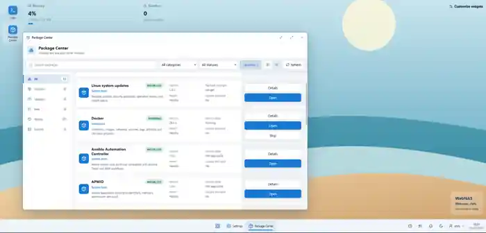
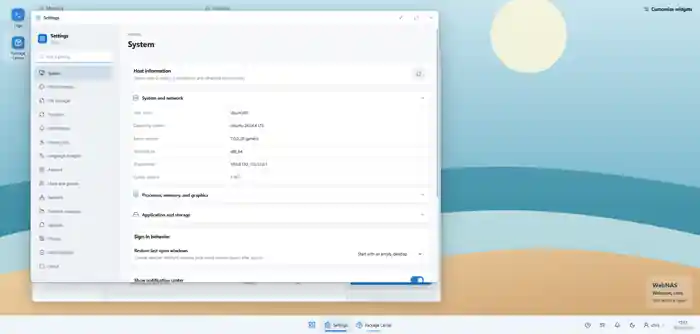

<div align="center">

# WebNAS

**A modern web-based administration panel for managing Linux servers, files, services, and infrastructure.**

FastAPI · React · TypeScript · Local users · PAM · LDAP · systemd · rsync

[Installation](#installation) · [Features](#key-features) · [Modules](#modules) · [Documentation](#documentation)

</div>

---

## About

**WebNAS** provides a clean browser-based interface for managing a Linux server, inspired by modern desktop environments and NAS administration platforms.

It combines file management, system administration, user management, containers, networking, logs, automation, and infrastructure modules in a single interface.

Main project goals:

- application-owned local user authentication by default,
- optional system authentication through PAM and LDAP,
- modular architecture,
- granular RBAC permissions,
- controlled administrative operations,
- responsive desktop and mobile interface,
- simple installation and updates through a single installer.

## Screenshots

### Dashboard


### Package Center



### Settings



## Key Features

| Area | Capabilities |
|---|---|
| **Authentication** | Default WebNAS local-user database, or mutually exclusive system mode with PAM and optional LDAP/StartTLS/LDAPS |
| **File Manager** | Browse files, upload, edit, copy and move with `rsync`, monitor transfer progress |
| **Desktop UI** | Application windows, taskbar, Start menu, shortcuts, themes, wallpapers and per-user personalization |
| **Users & Groups** | Manage WebNAS local users plus Linux users/groups and granular application permissions |
| **Networking** | Interfaces, VLANs, bridges, bonds, DNS, routing, diagnostics and controlled network changes |
| **Network Resources** | SMB/CIFS, NFS, SSHFS and WebDAV integrated with File Manager |
| **DCST** | Logical `APMID.ENV` segmentation, reusable Ports/IPSets/Services, Proxmox Firewall reconciliation, block/unblock, drift detection and firewall diagnostics |
| **Containers** | Docker Engine, images, containers, Compose, networks, volumes, registries, backups and diagnostics |
| **Package Center** | Install and manage WebNAS modules |
| **Logs** | System logs, `journalctl`, kernel, services and Docker container logs |
| **Activity Center** | History of sign-ins, administrative changes, file operations and module jobs |
| **USB** | Automatic detection and mounting of supported USB storage devices |
| **Hosts Manager** | Central host inventory, SSH connections, repositories and power profiles |
| **Secrets Manager** | Authoritative WAC2-encrypted secret storage, module sharing, usage audit, encrypted backup/restore and compatibility migration from legacy Credentials |
| **Fail2Ban Manager** | Jail/service state, bans/unbans, managed overrides, validation/rollback, bounded logs and security events |
| **Webhook Manager** | Event subscriptions, delivery history, retry/backoff, HMAC signing and Secrets Manager-backed authentication with SSRF protection |
| **Automation** | Ansible Automation Controller, schedules and Cron Manager |
| **DHCP** | Kea DHCPv4 / ISC DHCP subnets, pools, reservations, leases, diagnostics and transactional configuration |

## Modules

WebNAS includes a modular **Package Center** that allows infrastructure features to be added without expanding the core application.

Available and supported modules include:

- Samba
- Ansible Automation Controller
- Docker / Containers Manager
- Linux Updates
- DATA Communication & Segmentation Tool - DCST
- Proxmox Manager
- Secrets Manager
- Fail2Ban Manager
- Webhook Manager
- Nginx
- Squid Proxy
- Syncthing
- PostgreSQL
- MariaDB
- Redis
- central APT/RPM repositories
- Cron Manager
- DHCP Manager (Kea DHCPv4 / ISC DHCP)

Containerized applications can also be deployed through **Containers Manager**, including:

- Home Assistant
- Pi-hole
- AdGuard Home
- Uptime Kuma
- Jellyfin
- Nextcloud
- Nginx Proxy Manager

## Installation

### Requirements

- Linux with `systemd`
- `root` or `sudo` access
- Python **3.14**
- Node.js + npm
- `rsync`
- `openssl` for the first-install TLS certificate when no certificate is supplied
- supported package manager: `apt`, `dnf` or `yum`

WebNAS is designed for systems including Debian, Ubuntu, Raspberry Pi OS, Fedora and RHEL-based distributions.

### Quick Install

```bash
curl -fsSL https://raw.githubusercontent.com/chmajster/Algen-server-web-explorer-panel/main/install.sh | sudo bash
```

New standard installations publish WebNAS through the stable nginx gateway with HTTPS enabled. When no certificate exists at the configured paths, the release helper creates a private self-signed certificate before the gateway is activated.

After installation, WebNAS is available by default at:

```text
https://SERVER_IP:5000
```

A browser will warn about the generated self-signed certificate until it is trusted or replaced with a certificate issued by your local/public CA.

### First login

The default authentication mode is **Local database**. On first initialization WebNAS creates a local application administrator named `admin` with a cryptographically random password. The local user database stores only a salted `scrypt` hash.

During installation the recoverable bootstrap copy is held only as an encrypted one-time secret in the existing Secrets Manager. After the release health check the standard installer prints the credentials once to its terminal and immediately deletes that temporary encrypted secret. WebNAS does not create a plaintext password file.

Example output:

```text
Initial local administrator credentials:
Username: admin
Password: <random-password>
IMPORTANT: this password is displayed once and is not stored in plaintext.
```

Store the displayed password securely and change it immediately after the first login.

Standard installations also create or reuse a locked, non-interactive POSIX mapping for local WebNAS users so filesystem operations can run under a dedicated Unix UID/GID. The application password is never written to `/etc/shadow`; the POSIX account uses `nologin` and a locked system password.

Plaintext HTTP on a non-loopback interface requires the explicit `security.allow_insecure_http: true` opt-in and is intended only for isolated lab environments. Portable mode remains HTTP but binds to `127.0.0.1` by default.

### Custom Port

```bash
curl -fsSL https://raw.githubusercontent.com/chmajster/Algen-server-web-explorer-panel/main/install.sh | sudo bash -s -- --port 8080
```

### Update

Run the installer again:

```bash
curl -fsSL https://raw.githubusercontent.com/chmajster/Algen-server-web-explorer-panel/main/install.sh | sudo bash
```

The installer detects an existing WebNAS installation and performs the supported update procedure. Existing pre-policy HTTP configurations are preserved during normal updates for compatibility and emit a security warning instead of being silently rewritten; regenerate/update the configuration when you are ready to move that installation to TLS.

Full installation documentation: [INSTALL.md](INSTALL.md)

## Architecture

```text
Browser
   │
   ▼
React + TypeScript
   │
   ▼
FastAPI
   │
   ├── Local WebNAS user database (default)
   │       └── locked POSIX UID/GID mappings
   ├── System authentication mode
   │       ├── PAM / local Linux users
   │       └── optional LDAP / directory identities
   ├── File operations / rsync
   ├── systemd
   ├── Docker
   ├── Network management
   ├── Package Center
   ├── Secrets Manager / encrypted consumer contracts
   └── WebNAS modules
```

Core technology stack:

- **Backend:** Python 3.14 + FastAPI
- **Frontend:** React + TypeScript + Vite
- **Authentication:** WebNAS local database by default; alternative PAM + optional LDAP mode
- **Authorization:** central WebNAS RBAC
- **Service management:** systemd
- **File transfers:** rsync
- **Application/module state:** configuration files and SQLite depending on the component

The frontend uses feature boundaries, a shared WebNAS Design System and generated OpenAPI TypeScript DTOs. See [docs/frontend-architecture.md](docs/frontend-architecture.md) for component ownership, import rules and the standard `PageHeader -> DataTable -> Drawer/Modal` administrative UX pattern.

## Authentication

WebNAS has two mutually exclusive global authentication modes.

### Local database — default

`Local database` is the default mode. Only users stored in the application-owned local user database can sign in. PAM and LDAP are not offered on the login page in this mode.

Local passwords are stored only as salted `scrypt` hashes. The database stores roles and non-secret account metadata; it never stores plaintext passwords. Built-in roles use the existing central WebNAS RBAC matrix.

For filesystem isolation, standard installations create or reuse a safe POSIX mapping for each local WebNAS user. A generated companion account has a locked system password and `nologin`; authentication still occurs solely against the WebNAS local database.

Administrators can create, disable, delete and change roles/passwords for local users in **Settings → Administration → Authentication**. The last enabled local administrator cannot be disabled, downgraded or deleted.

### PAM / LDAP system mode

An administrator can switch the application to `PAM + LDAP` system authentication mode. Local-database authentication is then unavailable on the login page.

PAM is always available in system mode. LDAP remains optional:

- LDAP disabled: PAM only, with no provider selector;
- LDAP enabled: LDAP and PAM are shown; LDAP is selected by default;
- the user may manually select PAM;
- there is no automatic LDAP → PAM or PAM → LDAP fallback.

LDAP supports plain LDAP, LDAP + StartTLS and LDAPS. TLS certificate verification is enabled by default. LDAP user-search values are escaped according to RFC4515, exactly one directory entry must match, and the discovered user DN is authenticated with a separate user bind.

The LDAP Bind Password is stored through the existing encrypted Secrets Manager and is never returned by Settings APIs. LDAP identities must resolve to a safe POSIX UID/GID/home through NSS, for example with SSSD, nslcd or winbind. LDAP identities do not automatically inherit WebNAS administrator rights from `sudo`, `wheel` or directory groups.

Changing the global authentication mode invalidates active sessions and requires users to authenticate again through the newly selected mode. This prevents a session authenticated in one identity namespace from remaining active after a mode switch.

The public `/api/auth/config` endpoint exposes only the active authentication mode, available login providers and default provider; it never returns LDAP connection settings, DNs, password hashes or secrets.

See [AUTHENTICATION.md](AUTHENTICATION.md) for the complete mode model and [LDAP_AUTHENTICATION.md](LDAP_AUTHENTICATION.md) for OpenLDAP, FreeIPA and Active Directory configuration.

## Security

WebNAS uses an application-owned local user database by default and can alternatively use system PAM with optional LDAP.

The project includes:

- salted `scrypt` password hashing for local WebNAS users,
- a random initial local administrator password delivered once by the standard installer, with its temporary recoverable copy encrypted in Secrets Manager and deleted after retrieval,
- locked/non-interactive POSIX mappings for local application users in standard deployments,
- PAM authentication restricted to local `/etc/passwd` accounts in system mode,
- optional LDAP/StartTLS/LDAPS authentication with explicit provider selection and no automatic fallback,
- authentication-mode session invalidation,
- HTTPS-first standard installation with an explicit plaintext-HTTP opt-in,
- HttpOnly/SameSite session cookies and Secure cookies on the standard TLS configuration,
- granular RBAC permissions,
- CSRF protection for state-changing operations,
- path and operation validation,
- centralized bounded secret redaction for logs, exceptions and deployment errors,
- WAC2/ChaCha20-Poly1305 encrypted secret storage with a master key outside SQLite and metadata-only browser APIs,
- consumer-scoped secret sharing and audited backend secret access,
- webhook target validation with blocked loopback/link-local/metadata ranges, DNS-address pinning, no automatic redirects and separate critical permission for private networks,
- user and administrator activity auditing,
- controlled high-risk operations,
- automatic rollback for selected network changes,
- dependency auditing for Python and npm,
- CodeQL analysis for Python and JavaScript/TypeScript,
- release SBOM generation,
- **Proxmox Safe Mode** when a Proxmox VE host is detected.

> [!IMPORTANT]
> For production deployments on Proxmox VE, running WebNAS inside a VM or LXC container is recommended instead of installing it directly on the hypervisor host.

## Documentation

Detailed documentation is available in separate files:

| Document | Description |
|---|---|
| [INSTALL.md](INSTALL.md) | Installation, updates, configuration and troubleshooting |
| [AUTHENTICATION.md](AUTHENTICATION.md) | Local-database default mode, PAM/LDAP system mode, session isolation and local-user lifecycle |
| [LDAP_AUTHENTICATION.md](LDAP_AUTHENTICATION.md) | LDAP configuration, OpenLDAP/FreeIPA/AD examples, POSIX/NSS integration and security model |
| [docs/frontend-architecture.md](docs/frontend-architecture.md) | Frontend feature boundaries, Design System, generated API DTOs and module rules |
| [docs/testing.md](docs/testing.md) | Unit, integration, trusted system and Playwright E2E testing |
| [docs/deployment.md](docs/deployment.md) | CI/CD, trusted runner, production Environment, blue/green health checks and rollback |
| [HOSTS_MANAGER.md](HOSTS_MANAGER.md) | Hosts Manager |
| [SECRETS_MANAGER.md](SECRETS_MANAGER.md) | Secrets Manager, credential migration, encryption, sharing, backup/restore and rotation model |
| [FAIL2BAN_MANAGER.md](FAIL2BAN_MANAGER.md) | Fail2Ban status, jail configuration, bans, logs and safety model |
| [WEBHOOK_MANAGER.md](WEBHOOK_MANAGER.md) | Webhook subscriptions, retries, authentication/HMAC and SSRF controls |
| [ANSIBLE_CONTROLLER.md](ANSIBLE_CONTROLLER.md) | Ansible Automation Controller |
| [CONTAINERS_MANAGER.md](CONTAINERS_MANAGER.md) | Docker and Containers Manager |
| [CRON_MANAGER.md](CRON_MANAGER.md) | Cron Manager |
| [DHCP_MANAGER.md](DHCP_MANAGER.md) | DHCP Manager: Kea/ISC, subnets, reservations, leases, diagnostics and transactional configuration lifecycle |
| [DCST.md](DCST.md) | DCST architecture, Proxmox Firewall integration, Services, Ports, IPSets, TAGS, drift detection and troubleshooting |
| [PACKAGE_CENTER.md](PACKAGE_CENTER.md) | Package Center |
| [MODULES.md](MODULES.md) | Module architecture |
| [INFRASTRUCTURE_MODULES.md](INFRASTRUCTURE_MODULES.md) | Infrastructure modules |
| [IDENTITY.md](IDENTITY.md) | Users, roles and permissions |
| [APMID.md](APMID.md) | Application ownership and resource registry |
| [OS_REPOSITORIES.md](OS_REPOSITORIES.md) | Central APT/RPM repositories |
| [CHANGELOG.md](CHANGELOG.md) | Project changelog |
| [docs/self-hosted-runner-security.md](docs/self-hosted-runner-security.md) | Self-hosted runner trust boundary, labels and hardening |
| [docs/releasing.md](docs/releasing.md) | Version bump, tag and GitHub Release process |

## CI, versioning and releases

Pull Request CI runs on GitHub-hosted runners and validates backend quality/unit/integration/security, frontend lint/type/Vitest/build/OpenAPI contract, Playwright E2E, dependency audits and shell syntax. CodeQL and dependency review run as separate security workflows.

Self-hosted homelab jobs are separated into a trusted workflow that accepts only merged `main` code. Production deployment uses a trusted `self-hosted`, `linux`, `deploy` runner and the `production` GitHub Environment. The deployment reuses the existing blue/green slots, checks liveness/readiness after handover and restores the previous release if post-deploy smoke tests fail.

`VERSION` is the single source of truth for the application version. Verify synchronization with `python scripts/sync-version.py --check` and bump with `--bump patch`, `--bump minor`, or `--bump major`.

Tags in the form `vX.Y.Z` trigger the release workflow. The tag must match `VERSION`; the workflow rebuilds and tests the backend and frontend, creates SHA256 checksums, generates CycloneDX backend/frontend SBOM files and publishes the artifacts as a GitHub Release.

## Useful Commands

Check service status:

```bash
sudo systemctl status webnas
```

Restart WebNAS:

```bash
sudo systemctl restart webnas
```

Follow logs:

```bash
sudo journalctl -u webnas -f
```

## Repository

```bash
git clone https://github.com/chmajster/Algen-server-web-explorer-panel.git
cd Algen-server-web-explorer-panel
```

---

<div align="center">

**WebNAS — one interface for managing your Linux server.**

</div>
